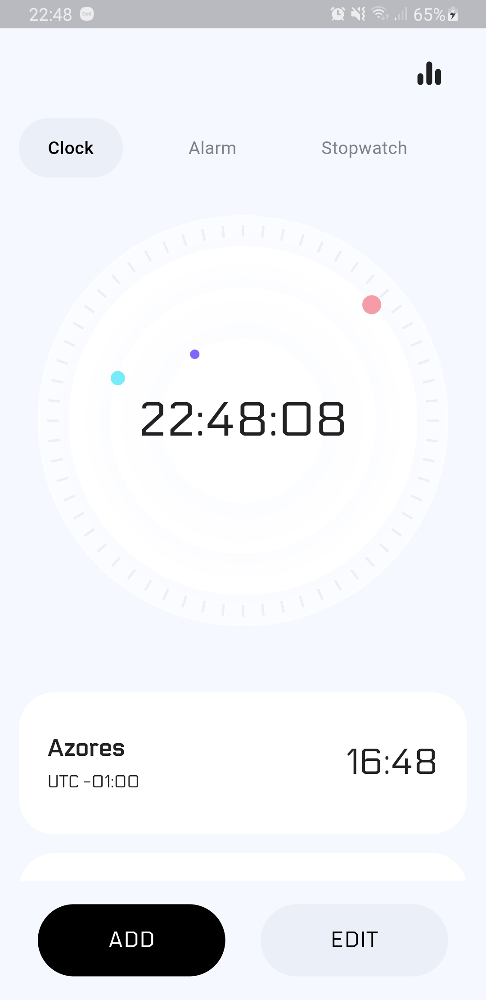

# Clock App

A [Flutter](https://flutter.dev/) application with bunch of interesting functions.
This application was built without any architecture packages in order to demonstrate my programming skills.
Architecture is deliberately created by [Me](https://github.com/JollyGoal/) using flutter's default state management system and dart:async, so even the built-in options like StreamBuilder were excluded.

[Download APK](release/clock.apk)

[See demo mp4](release/record.mp4)

## Features
- [x] Beautiful UI
- [x] Architectural packages free (more state control)
- [x] Save states for all pages
- [x] Add/remove laps in "Stopwatch" screen
- [ ] Save timer preferred settings in "shared preferences"
- [ ] Add & delete "World Clock" and "Alarm" elements
- [ ] Save "World Clock" and "Alarm" info on local database
- [ ] Background Alarm system


## External Packages
```
dependencies:
  google_fonts: ^1.1.1
  flutter_launcher_icons: ^0.8.1
  flutter_launcher_name: ^0.0.1
```

## Screenshots

|World Clock Screen|Alarm Screen|Stopwatch Screen|
|---|---|---|
||||
|---|---|---|
|Timer Picker Screen|Timer Progress Screen|Demo GIF|
||||


## Credits

* Style [Dribbble](https://dribbble.com/shots/14149622-Alarm-Clock-Minimal-App)

